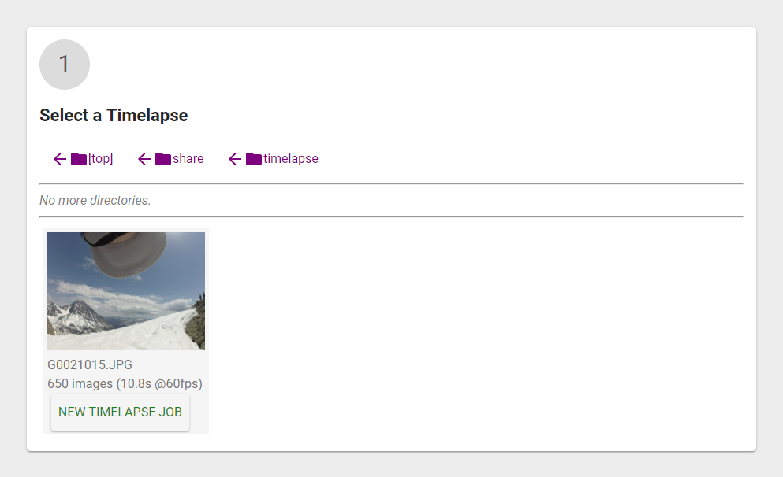
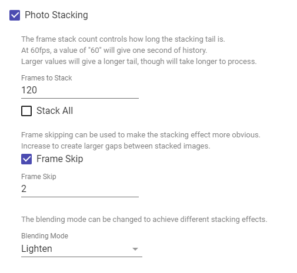
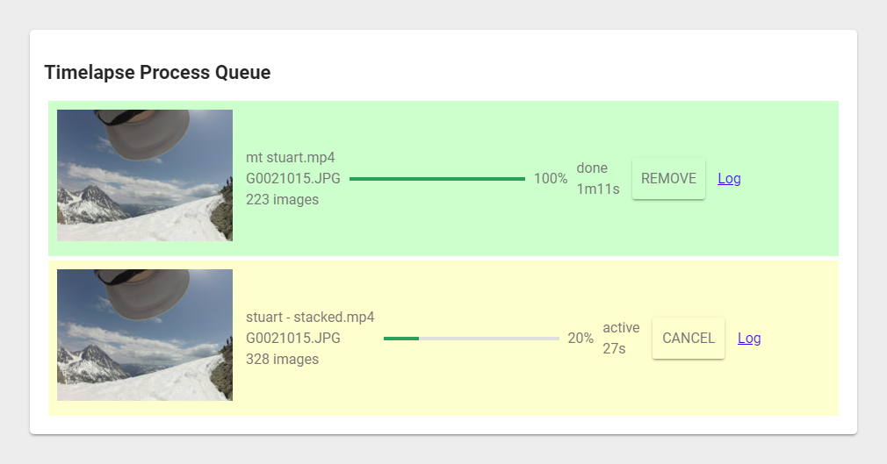

# Timelapse Queue

A web frontend FFmpeg wrapper for easily, user-friendly generation of
timelapses from image sequences.

Output files are 1080p MP4 files intended to work with Adobe Premiere for
further editing.

This project is used for the [HikeArt YouTube Channel](https://youtube.com/hikeart).

## Getting Started

The easiest way to start using this project is by installing the public Docker image.

If you're not familiar with running a Docker container see:
https://docs.docker.com/get-started/

To download and run the timelapse-queue image:

```shell
# Point this at a directory containing timelapses you wish to process.
# The path must be absolute.
TIMELAPSE_DIR=/home/jeff/

docker run \
    -p 8080:8080 \
    --mount type=bind,source=${TIMELAPSE_DIR?},target=/mnt/fsroot \
    jheidel/timelapse-queue
```

Once it's running, navigate to http://localhost:8080.

TODO: provide some guidance for running this as a service.

## Software Overview

Timelapses are configured via a web application, written using [Polymer 3](https://www.polymer-project.org/).

The backend is a monolithic [Go](https://golang.org) binary which is
responsible for serving the web frontend as well as processing the timelapses.

The timelapse server reads images sequentially and applies any resizing &
cropping & image stacking effects. The images are then piped to a
[FFmpeg](https://www.ffmpeg.org) binary run as a subprocess which writes out
the video file. The server manages queueing of jobs so that at most one FFmpeg
operation is running at a time.

## Build Instuctions

1) Run `make`
1) Resolve errors (probably missing dependencies)
1) Repeat until success

This project was developed on Ubuntu 18.04 (and will likely work with other
platforms with a couple rough edges).

It has only been tested on Google Chrome and may encounter issues with other
browsers.

To build the Docker image:

```
docker build -t timelapse-queue .
```

Also available on Docker Hub:

https://hub.docker.com/r/jheidel/timelapse-queue/

## Project Status

Initial implementation complete. Some further development is planned as I have
time, mostly for an archival feature to convert large image sequences into a
high quality 4k archive format which can later be re-processed into timelapses.

## Screenshots

A timelapse job starts with a file browser. Images are grouped into timelapse sequences.



The timelapse job then requires some simple configuration.


Photo stacking effects are available.



Timelapse jobs go into a queue and are processed sequentially using FFmpeg.


